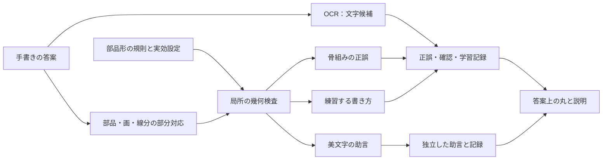

# ひとふでヒント：漢字の字形判定・書き方・美文字を広げる設計

作成日：2026-10-10。確認した実装：`0a536ec4fd2f60c320c4455affb50ffc1758ec88`。
追補：同日、横画・縦画の長短、部品の縦横比、部首ハンターの資源調査を追加。
対象リポジトリ：`C:/Users/user/kanji-hint-drill`。
本書は次のチャットで使う実装仕様であり、ここに記す新しいエンジン・規則・画面は未実装。
現状との境界を明記し、実装時は最新の作業ツリーと照合する。

## 1. 到達する状態

OCRが目標の字として認識しても、骨組みの違いを見逃さず、直す場所を具体的に示す。
同時に、字として認められる書き方の違いと、美しく整えるための助言を誤字に混ぜない。
共通エンジンと部品の規則を作り、1,026字の適用状況を監査できる状態にする。

- 児童には「どこを、どう直すか」を、書いた線・丸・短い言葉で伝える。
- 先生・保護者は、項目ごとの確認の有無と許容幅を調整できる。
- 同じ部品の規則を共有し、偏・旁・単独などの形や、字ごとの例外を指定できる。
- 横画・縦画の長短の関係と、部品の幅・高さの比率を、字・部品形ごとに評価する。
- 線の欠落・余分・画の分割・折れを扱い、総画数だけで診断を打ち切らない。
- 未対応の字を対応済み扱いにしない。自動テストの通過と、教育上の目視確認を別に記録する。
- 最初は小さな代表字群で動かし、目視確認後に同じ部品を持つ字へ展開する。

## 2. 正誤・書き方・美文字の境界

| レイヤー | 何を確認するか | 例 | 記録への影響 |
|---|---|---|---|
| `identity` | 他の字と区別する骨組み、部品の必要な線・位置関係 | 鉄の右側の必要な突出、見の目の内側の横線の過不足 | 高い確信で失敗なら誤答。不明なら自己確認 |
| `writing` | 今回練習する筆順・向き・終筆の形 | 知の5画目を短く収める、偏の下画を払い上げる | 字は書けた扱い。課題未達なら確認付き正解・書き方の復習 |
| `beauty` | 整った形のための任意の助言 | 平行、適度な右上がり、間隔、線の長短、部品の細さ、払いの終端 | 自力正解・習得・復習時期を変えない。助言だけ別記録 |

**判定種類と教育上の扱いは別の属性にする。** `connection`は一律に誤答規則ではない。
接触の有無が字の骨組みを変える場合は`identity`、授業の書き方として求める場合は`writing`、整える助言なら`beauty`。
規則ごとに根拠を確認して分類する。厳しさを上げても`beauty`を誤答に昇格させない。

文化庁の説明では、手書きと印刷の形の違い、骨組みを保った細部の多様性を認めている。
この考え方を字形の許容の根拠とし、授業の書き方の指定とは区別する。[文化庁：指針の趣旨](https://www.bunka.go.jp/prmagazine/rensai/kotoba/kotoba_009.html)
個々の接触・突出・終筆の扱いは、当該字の資料と利用する教材で確認し、総論から自動推定しない。
「知の5画目はとめる」は本アプリの練習条件候補。長い払いをすべて誤字と断定する根拠にはしない。

### 現在の鉄との互換

現実装は`checks`と`beautyChecks`の二つ。金偏の上下端・接続・払い上げも`fail`で誤答にする。
最初のエンジン移行では、鉄を`legacy-iron-v2`プロファイルとして固定し、現在の設定・合否・焦点を維持する。
新しい`writing`への分類変更は、規則ごとの根拠確認と目視レビューを経た別の変更にする。
黙って判定を緩めたり、既存の学習記録を再採点したりしない。

## 3. 現状で使えるもの・不足するもの

| 現在の資産 | 次の実装での扱い |
|---|---|
| DaKanjiのOCR | 文字候補を得る。部品・終筆の検査は独立させる |
| `data/curriculum.json`の1,026字とSVGパス | 出題範囲・筆順表示を維持。手本の線は唯一の正解図形としない |
| `shape-rules.mjs`の一対一対応・局所距離・角度 | 鉄の比較基準として残し、共通エンジンへ段階移行 |
| `protrusionFocus`・可変丸・複数指摘ボタン | 座標を画面へ戻す契約を維持し、欠落箇所にも対応 |
| `normalizeShapeSettings`・端末保存 | 旧キーの読み込みと初期値を維持し、新設定へ移行 |
| `shapePolicy`・`beautyNotes`・自己確認 | 互換を維持し、規則の版・結果・未評価を追加保存 |
| 漢字カード選択・例文・読み練習 | 判定エンジン移行とは独立して保持 |

重要な制約：現在は全画数が一致しないと字形検査全体が`uncertain`になる。
そのまま規則だけ増やしても、見の横線の欠落・追加をピンポイントには指摘できない。
画の過不足に対応する部品抽出と部分対応を、規則の大量追加より先に実装する。
また、入力は`{x,y}`のみ。停止時間・筆圧・実際の紙上のとめ／はらいは観測できない。

## 4. データは「字 → 部品の出現 → 部品形 → 規則」に分ける

### 4.1 部品の出現と、意味上の部首を混同しない

判定に必要なのは幾何的な部品である。部首一覧だけから対象を決めない。
同じ字の中の複数の「口」「木」「目」を、別の出現IDで扱う。出現は入れ子を許す。
一つの画が複数の説明用部品に所属することは許容し、重複する規則はIDで整理する。

| 部品形IDの例 | 使い分け |
|---|---|
| `metal.left` | 鉄・銀などの金偏。単独の金と分ける |
| `earth.standalone` / `earth.left` | 土と土偏。下の横画／払い上げの規則を混同しない |
| `jade.standalone` / `jade.left` | 王・玉との関係を資料で確認した上で、玉偏の形を独立定義 |
| `arrow.standalone` / `arrow.left-compact` | 矢と、知の左側。終画の収まり・周囲との干渉を別指定 |
| `eye.standalone` / `eye.top` | 目と、見の上部など。内側の横線数は共通、比率は別指定 |

位置だけで形を決めない。部品形IDは資料・手本・対象字で確認して割り当てる。
部品の同定自動化は候補生成まで。公開用の対応表にはレビュー済みの明示的な割り当てを保存する。

### 4.2 意味のある画の役割を付ける

規則は「この字の12画目」ではなく、`stem`、`upperBar`、`lowerBar`、`roofLeft`、`roofRight`、`risingBase`などの役割を参照する。
字ごとの対応表が役割をSVGの画・画内の区間に結び付ける。
人が編集する番号は1始まり。配列添字の0始まりへの変換は読み込み時に一度だけ行う。
説明に示す標準筆順番号と、答案で何番目に書いた画かは別の値として保持する。

折れ画は、一画の中に横線・縦線を持つ。役割は画全体に加え、弧長の区間や折れ点に結び付けられるようにする。
線の形の検査では折れ画を線分に分けても、画数を増やした扱いにはしない。

### 4.3 KanjiVGの部品情報を取得する

現データ生成はSVGの`d`だけを取り、グループ・画の型を保持していない。
元のSVGには部品のグループや位置・変形・分割を表す属性がある。[KanjiVG SVG仕様](https://kanjivg.tagaini.net/svg-format.html)
XMLパーサーで階層を読む。正規表現だけで入れ子の部品を取得しない。
`element`だけでなく`original`、`variant`、`position`、`part`、`number`、`partial`、画ID・型も候補情報として保存する。
属性の欠落・不整合・非連続な所属を想定する。元データのグループ番号を自前の永続IDにしない。

既存の`paths`を変えず、追加の`components`と対応メタデータを別の生成物にする。
元SVGの入手元・版またはハッシュ、生成器の版、レビュー修正を記録し、同じ入力から再生成できるようにする。
元SVGが取得できない場合は、レビューした少数字の手動対応表から始める。全字の部品を推測で埋めない。
KanjiVG由来の派生データの帰属・CC BY-SA 3.0は既存のprovenanceと合わせて維持する。

### 4.4 規則の契約（次の版の仕様例）

次の例は将来のスキーマ。現在の`CHARACTER_RULES`にそのまま貼り付ける形式ではない。

```json
{
  "id": "iron.right.stem-above-upper-bar",
  "version": 1,
  "instance": "right-main",
  "layer": "identity",
  "kind": "protrusion",
  "subject": {"role": "stem", "anchor": "start"},
  "reference": {"role": "upperBar", "anchor": "nearest"},
  "parameters": {"side": "above", "mustCross": true},
  "toleranceProfile": "iron-v2-protrusion",
  "requires": ["subject-matched", "reference-matched", "local-frame-stable"],
  "messageKey": "extend-stem-above-bar",
  "focusKind": "endpoint-pair",
  "review": {"status": "pending", "sourceIds": ["iron-existing-rule"]}
}
```

必須項目：永続ID・規則版・レイヤー・種類・対象役割・参照役割・パラメータ・許容幅プロファイル・前提条件・文言・焦点・根拠・レビュー状態。
部品形に共通規則を定義し、字の出現で役割を結び付ける。字固有の修正は明示的な上書きとして保存する。
規則の重複適用、存在しない役割、空の参照、版の不一致は生成時のエラーにする。
`review=pending`の新規identity規則は、評価用モードでのみ実行し、通常の答案を自動誤答にしない。

### 4.5 部首ハンターの資源を取り込む

ローカルの`C:/Users/user/kakijun/bushu-hunter`を調査済み。
`kanji_parts.json`の部品範囲、`radical_reference.json`の異体形・位置別名称、SVGの部品色付け処理を再利用する。
再利用の優先順位と、1,026字の実ファイル照合結果は[資源調査](handwriting-resource-audit.md)に記載する。
本アプリの全1,026字と元SVGのパス列は、順序と`d`文字列が一致した。
したがって、版・ハッシュを固定した移行では既存の画範囲を候補として結び付けられる。
一致が崩れた字は旧添字をそのまま使わず、再対応とレビューへ回す。

既存部品の`start/end/ranges`は0始まり・両端を含む。人が編集する1始まりの画番号とは取り込み時に変換する。
非連続な所属を表す`ranges`を優先し、start～endを全部含めた一連の部品と解釈しない。
全字の字形分解が完成したデータではない。見・青・金・月などの全体部首は、必要な内部役割をSVG階層から補う。
部首判定用に一つを選ぶ`quizParts`の処理を、全構成部品の抽出として流用しない。
`radical:true`のものだけでなく、形の検査に必要な非部首の部品も残す。
月／肉のように同じ見かけでも`original`が異なるもの、全体部首、重複所属、取りこぼしをレビュー対象にする。
部首アプリの`matched`は辞書部首との機械的照合であり、字形の合否・比率・教育上の許容幅の承認ではない。

取り込みは開発時に行い、本アプリに生成したデータを置く。実行時に別アプリのURLやユーザーの絶対パスをfetchしない。
元アプリとそのデータを修正する作業は混ぜない。更新は元データのハッシュ差分と適用先を確認して取り込む。
出典ごとの帰属と既存のライセンス表示を記録し、全データを一律にKanjiVGのCC BY-SA 3.0扱いにしない。

## 5. 判定の流れと座標の扱い



この三つの出力を最後に一つの点数へ混ぜない。

1. 元の入力と描画幅を保ったまま、非有限値・極端に短い線などを検査する。
2. 弧長で再サンプリングし、画数・入力方向・時系列を残す。
3. 字全体の移動と一様拡大縮小を補正し、部品候補と安定した骨組みを得る。
4. 画・線分・部品の部分対応を求める。未対応の答案線・必要な手本線を保持する。
5. 部品ごとの局所座標を安定した複数の線から作る。
6. 前提が満たされた規則だけ評価する。確かめられない規則を合格にしない。
7. identity、writing、beautyを独立集約し、OCRと組み合わせて学習結果を決める。
8. 評価した元の答案位置に焦点を出し、設定と規則版を記録する。

### 部分対応

現在の同数画のHungarian対応を残しつつ、未対応用のダミーを含む矩形の対応を追加する。
欠落を避けるために遠い線を無理に対応させない。ダミーのコストと採用上限はフィクスチャで校正する。
順番・書く方向をオフにした場合にも、形の役割を安定して割り当てられるようにする。
書く方向・終筆の動作を見るときは、参照の向きに反転した線ではなく元の入力方向を使う。

比較コストには位置・長さ・方向・近隣との接触関係を使い、最良の対応と代替対応の差を確信度に反映する。
見た目の重複線、一本を二回に分けた線、折れを複数画で書いた線を区別する。
見た目の骨組みを数える処理と、筆順上の画数を数える処理は別にする。
曲がり・折れ点は弧長と接線変化から候補抽出し、細かな震えを新しい線分として数えない。

### 局所座標と確信度

突出・接触は局所の相手の線と比較する。曲がった横画は実際の近傍線を使い、無限延長した直線との交差だけで判定しない。
局所基準線が短すぎる、潰れている、曲がりが強く向きが定まらない場合は`uncertain`。
検査する線だけで局所座標を作って、その誤りを正規化で消さない。
横線が欠けた場合も、周囲の側線・外枠から対象部品の範囲を推定できれば、その部品だけ検査を続ける。
大きな逸脱・斜めの別線で対象を特定できなければ、総画数が違うという理由だけで欠落場所を断定しない。

対応探索の回転補正は小さな候補範囲に制限し、反転・90度回転を同じ字として吸収しない。
許容する字全体の傾きの候補範囲は初期実装で±12°を検証対象とする。児童筆跡で校正するまで保証値としない。
構造の比較は局所の軸、美文字の右上がりは画面の水平が基準。両者を混ぜない。
表示には必ず元の答案座標を使い、補正用の回転や拡大縮小を二重適用しない。

## 6. 共通の検査器

| 検査器 | 判定する量 | 注意・主な用途 |
|---|---|---|
| `protrusion` | 指定した側への端点の突出量、実線との交差 | 鉄の右側。方向・相手線・端点を指定 |
| `boundedEndpoint` | 境界の外へ出た量 | 金偏の縦棒の上下。短すぎる線の接続は別規則 |
| `contact` | 端点対端点／端点対線／線同士の最短距離 | 見かけの接触を描画幅・座標の誤差込みで判断 |
| `separation` | 指定箇所の必要な空隙 | 接してはいけない箇所。接触規則の反転と安易に同一視しない |
| `crossing` | 線の交差と、交差前後の連続性 | 突き抜ける／接して止まるの区別 |
| `risingStroke` | 局所横軸に対する進行方向・傾き | 金偏・土偏・玉偏などの指定した下画 |
| `compactEnding` | 終画の長さ・末端位置・隣の部品との空隙 | 知の5画目。実際に停止したかとは言わない |
| `hookGeometry` | 安定した曲がりと、末端の短い方向変化 | はねの形。微小なノイズ・一律の長さ基準に注意 |
| `sweepGeometry` | 主進行・終端区間の方向・収まり | 右払いの向き。筆圧による細さは別の観測 |
| `internalBars` | 外枠内の独立した横線の数・範囲 | 見・目・日。折れ画に含まれる上辺は内側に数えない |
| `parallel` | 指定した線同士の接線／代表方向の差 | 美文字。必要以上に正規化して方向差を消さない |
| `upwardSlope` | 画面の水平に対する代表角度の範囲 | 美文字。SVGへの一致を求めない |
| `spacing` | 指定した連続する空間の偏り | 美文字。字全体の横線を自動的に等間隔にしない |
| `lengthOrder` | 指定した主線同士の長短の差 | 三・青・金の横画、刂の縦画。必要な比較対だけ指定 |
| `lengthRatio` | 主線の長さの比率と許容区間 | 順序は正しいが差が弱い／極端な場合の助言 |
| `componentAspect` | 部品本体の幅／高さ、配置内での幅 | 月を細めにするなど。単独・偏・旁・下部を別プロファイルにする |

線分の方向・終端は、最終の二点だけではなく複数の弧長窓で推定する。
短すぎる区間では判定を出さず、窓同士の推定が大きく食い違えば自己確認または未評価にする。
接触は中心線のゼロ距離を要求しない。描画の線幅と小さな筆離れの許容を別パラメータで持つ。
突出には長さの上限／下限だけでなく、参照線上のどの範囲と比べているかを確認する。
距離は部品の基準長で無次元化し、角度は度、線数は整数にする。画面pxを字形の閾値にしない。

## 7. 線の過不足をピンポイントに指摘する

### 見・目・日の例

現在のデータでは、見は7画、上部の目は1～5画目、内側の横線は3・4画目。
単独の目は5画・内側の横線2本、日は4画・内側の横線1本。
これは全体画数ではなく、**外枠を除いた内側の横線数**の差として検査する。
将来のデータ版ではこの対応を役割・部品IDで表し、番号の一致を前提にしない。

1. 左右の側線、上辺、下辺を、折れ画の区間を含めて特定する。
2. 部品内に評価範囲を作り、上辺・下辺や「儿」の線を除外する。
3. 傾きや曲がりを許容しつつ、内側を横断する横線候補を抽出する。
4. 途中で筆を離して分割した候補を結合し、なぞり直しの重複候補を統合する。
5. 複数の横位置で線の通過と長さを確認し、短い点・ゴミを横線に数えない。
6. 内部に2本必要／1本必要という条件と比較する。
7. 過不足・不確かさを、対象部品・実線・推定される不足領域と一緒に返す。

外枠が曖昧、線が潰れて二本か一本か判別できない、短い横線が途中で切れている場合は、無理に整数へ丸めず`uncertain`。
位置が少しずれていても独立した二本なら、線数は合格、美文字の間隔は別に評価する。
同じ線のなぞり直しは、骨組み上の余分な横線とはしない。筆順上の二重書きは`writing`で扱う。
全体の画数が一致していても、別の場所の余計な線で不足を相殺しない。

児童向け文言：

- 不足：「上の『目』の 中の横線が、1本 足りないよ。中には 2本 書こう。」
- 余分：「上の『目』の 中の横線が、1本 多いよ。中は 2本に しよう。」
- 不明：「上の『目』の 中の横線を、お手本と 比べよう。」

不足した線は、答案に存在しないため実線の画番号を返さない。
外枠や残った線で目の部分を囲み、必要なら不足領域を薄い帯で示す。
どちらの内側線が欠けたか特定できなければ「3画目がない」と言わず、目の部分全体と本数を示す。
正確な位置を推定できる場合だけ補助の破線を出す。お手本の位置をそのまま答案上に貼り付けない。

## 8. とめ・はね・はらいの観測範囲

### 当面：終筆の形を観測する

とめの実動作ではなく、末端が短く収まるか、方向転換があるか、長い払いの形になっているかを観測する。
長さだけで分類しない。部品内の終点位置・尾の方向・隣接部品との空隙・曲率を組み合わせる。
「知の5画目」の短い終画は、長い右払いとの対比と口への干渉を使う。
隣の口がずれているだけで終画を長すぎると断定しない。終画自体の比率と周囲との関係を別々に確認する。
本文の指摘は「少し短く収めよう」「終わりの向きを比べよう」とし、観測していない停止・筆圧を断言しない。

### 後段：入力を増やした場合

原入力に任意の`t`・`pressure`・`pointerType`を追加できる構造にするが、取得できない端末でも練習できるようにする。
弧長再サンプリングした幾何点列と、生の時刻・筆圧点列を別に保持する。
ブラウザのイベント間隔は実際の停止時間をそのまま表さず、マウスや指のpressureも筆圧の観測とは限らない。
入力の品質を確認した端末だけで速度低下・方向転換などの補助情報を使う。時刻や筆圧の欠落を誤答にしない。
停止・押し付け・抜きの精度を確認するまでは、UIに「とめを検出した」「筆圧が弱い」と表示しない。
筆跡の保存・共有は後段の独立機能。既存の学習記録に全座標を自動追加しない。

## 9. 許容幅・設定・校正

### 9.1 共通設定と個別調整

初期の設定画面は三つのまとまりにする：字の骨組み、練習する書き方、美文字のヒント。
各項目は見ない／ゆるめ／標準／厳しめ。線数のような離散条件は見ない／確認する。
美文字は初期オフ。書き方の新規項目は根拠と目視レビュー後に推奨値を決める。
はねを軽く見たいなどの要望を、他の終筆・突出に影響させず設定できるようにする。

詳細設定は、字を選んだときだけ表示する「この字だけの調整」に収める。
安定した規則IDを使い、次の優先順位で有効レベルを決める。

1. 全体の検査カテゴリが「見ない」なら必ずスキップ。個別例外で勝手に再開しない。
2. 美文字全体がオフなら美文字規則はすべてスキップ。
3. 有効なカテゴリ内では、字の規則ごとの例外 → 字のカテゴリ設定 → 共通カテゴリ設定 → 規則の推奨値。
4. 未設定は継承。設定画面に、実際のレベルと継承元を明示する。

複数字をまとめた変更では対象と変更値を見せる。おすすめに戻す際も、共通設定と字別例外のどちらを戻すか分かる操作にする。
判定中の設定変更は、その答案には反映せず、判定開始時に固定した設定スナップショットを使う。
未対応のカテゴリは「確認できた」と表示しない。未対応の字への効果がないことは先生向けに示す。

### 9.2 数値の定義

各プロファイルは、値の単位、最小／最大、境界の帯、線幅・ノイズ補正、測定に必要な長さを持つ。
下限規則はゆるめ ≤ 標準 ≤ 厳しめ、上限規則はゆるめ ≥ 標準 ≥ 厳しめ。
厳しめで合格した答案が標準・ゆるめで不合格にならないよう、境界帯を含めて検証する。
境界の答案は`uncertain`にする。根拠の薄い差を二択で誤答にしない。
文字別の数値は共有プロファイルを継承し、例外の理由を残す。

現在の鉄の試作値は互換プロファイルとして固定する。
突出：6／14／26%、境界帯±2／3.5／5%。金偏の突出の許容上限：13／7／4%、±1.2%。
接続間隔の上限：1画目の始終点距離に対して23／18／12%、±1.5%。
払い上げ：3画目の横画に対して2／7／12°、±2°。
これらは児童の実筆跡で校正した一般基準ではなく、他の部品へそのままコピーしない。

### 9.3 実筆跡で校正する手順

代表字ごとに、正しい答案・許容される揺れ・学習上直したい形・明確な骨組み違いを分類する。
合成したSVG変形だけでなく、複数の書き手と端末から得た実筆跡を目視ラベル付きで評価する。
集められない段階は「合成検証のみ」と明示し、新しいidentity規則を強い断定に使う範囲を限定する。
校正用と検証用を書き手単位で分離し、同じ書き手の似た答案で精度を過大評価しない。
不一致のラベルは再レビューし、許容例を勝手に誤字へ変更して数値を合わせない。
閾値・境界帯は規則／部品形ごとに選び、正しい答案の誤拒否、誤りの見逃し、要確認の割合を併記する。
実筆跡を取り扱う機能を作る場合は端末内を基本にし、外部へ共有するときは利用者が選ぶ。

## 10. 美文字の評価

SVGは画の役割・見本表示に使い、美文字の理想をSVGとの差分から作らない。
右上がりは画面の水平に対する範囲、平行は指定した横線同士の方向差で評価する。
実際に書いた線の揺れで端点だけが偏る場合は中央区間の代表方向も比較し、安定しなければ未評価にする。

間隔は対象群を明示する。目の上辺・内側2本・下辺なら、間にある三つの空間を対象候補にする。
複数の共通横位置で各線を評価し、局所の縦軸に沿った空隙の代表値を取る。
「上側だけ広い」など、そろえる相手を分かる言葉で指摘する。
必要な線が欠けている、重なっている、外枠を同定できない場合、間隔は評価しない。identityの不足指摘を優先する。
等間隔の対象は規則の`spacingGroup`で指定し、必要なら理想比率を持たせる。
鉄の金偏の全横線、王／玉の全横線を、検討せず一律の等間隔条件にしない。

初期の表示は「そろっている／ここを整えてみよう／まだ確かめられない」の項目別評価。
未評価を0点、未対応を満点にしない。総合点は実筆跡で校正するまでは出さない。
後で点数を導入する場合も、評価した項目・重み・未評価率を表示し、別の字や年齢の点数を無条件に比較しない。
美文字の成績は既存の学習stage・streak・dueから独立させる。

### 10.1 横画・縦画の長短と部品の細さ

「線をすべて同じ長さにする」と「指定した線に長短を付ける」は別の規則。
比較対象・必要な長短の関係・適度な差を明示し、手本のpx長や完全一致を求めない。
長さは主線方向への投影幅を基本にする。弧長だけでは、震えたり曲がったりした線が長い扱いになってしまう。
折れ画は横／縦の対象区間を指定し、縦はねの末端を主縦画の長さに足さない。
代表方向が不安定、区間の切り分けが曖昧、比較対象が欠落している場合は`uncertain`または`unavailable`。

役割ごとに主線の始端・終端・弧長区間を定義し、局所軸へ投影した範囲`L`を測る。
長いべき線をA、短いべき線をBとすると、長短差は`gap=(L_A-L_B)/max(L_A,L_B)`、比率は`ratio=L_B/L_A`とする。
`lengthOrder`はgapの必要な下限と境界帯、`lengthRatio`はratioの許容区間と境界帯を持つ。
分母が短すぎる、線が潰れている場合は判定しない。
全体を縮小しても比率は変わらず、曲線の震え・はね・装飾的な尾で順位が反転しないことを検証する。
必要な比較対だけを登録する。無関係な部品間を含めて字の全横画を自動ソートしない。

| 対象 | 比較する役割の候補 | 次の実装での具体的な評価 |
|---|---|---|
| 三 | 1・2・3画目の横画 | 下を長く、中を短くする関係。長短順序と差の大小を別に確認 |
| 青 | 上部の1・3・4画目 | 上部の横画の関係と、4画目の広がり。下部の月の内側線とは混ぜない |
| 金 | 3・4・8画目の横画 | 上・中・下の長さの差。金偏の8画目は払い上げなので、単独の金の下横画と別に定義 |
| 刂（まず利） | 左の短い縦線、右の長い主縦線 | 主縦画の長さの差、上端・下端の位置関係。右のはねは別規則 |
| 月 | 本体の左右側線と高さ | 細めの幅／高さ。単独、明の右側、服の左側、青の下部を同じ理想比率にしない |

この表は評価対象の指定であり、各字の教育上の唯一の字形・数値を承認した表ではない。
長短関係は資料と目視で確認し、SVGの数値は校正開始時の参考値として別に保存する。
知の短い終画のようなwritingの条件や、土／士・未／末などの区別に関わるidentityの長短関係にも同じ測定器を使える。
その場合もレイヤーは規則ごとに根拠を確認して指定し、美文字の長短評価を厳しさだけで誤答判定へ変えない。

「月」の本体幅は、左払い・右はねを含めた全筆跡の外接幅だけで測らない。
本体側線を高さの複数箇所で評価し、対応する幅の代表値と本体高さから`aspect=W/H`を取る。
本体形と、字全体の中で部品が占める幅の比率`allocation=W_component/W_character`は別の指標にする。
非一様な横方向正規化で月を引き伸ばしてから評価すると細さの違いが消えるため、一様倍率だけで測定する。
左払いの曲がり・はねの長さを変えても、適度な本体幅の合否が不必要に変わらないようにする。
月形と肉由来の月形は、外形が同じだからという理由だけで書き方・幅のプロファイルを共有しない。

文言例：「まんなかの 横線を、上の横線より 短くしてみよう。」
「金の 下の横線を、まんなかより 長くしてみよう。」
「りっとうの 右の縦線を、左より 長くしてみよう。」
「月の 部分を、少し 細めにしてみよう。」
順序が正しく差も十分な答案に、手本より数%違うだけという助言を重ねない。
順序と比率の同根指摘は一つにまとめる。

美文字の「線の長短」「部品の幅」は、それぞれ見ない／ゆるめ／標準／厳しめを用意し、初期オフにする。
既存の「位置・長さ」の粗いSVG比較と分離し、新規美文字項目の失敗で自力正解を減らさない。
書き方や骨組みで用いる長さの設定もレイヤー別に持ち、はねの厳しさ・平行・間隔に影響させない。

## 11. 結果の契約・集約・OCRとの接続

各規則の結果は`pass / fail / uncertain / skipped / unavailable`。
`skipped`は設定で見ない、`unavailable`は未実装・資料未確認・入力品質不足など。無評価を合格にしない。
`layer`を別属性にするため、美文字の`fail`も文字の誤答を意味しない。
旧UIへ渡すアダプターではbeautyのfailを現在の`review`へ変換し、移行中の互換を保つ。

結果に必要な情報：

```json
{
  "ruleId": "see.eye.internal-bars",
  "ruleVersion": 1,
  "layer": "identity",
  "status": "fail",
  "confidence": "high",
  "observed": {"count": 1},
  "expected": {"count": 2},
  "instanceId": "eye-top",
  "actualStrokeIds": ["stroke-3"],
  "referenceStrokeNumbers": [3, 4],
  "reasonCode": "missing-internal-bar",
  "messageKey": "one-bar-missing-in-eye",
  "focus": {
    "kind": "component-region",
    "coordinateSpace": "answer",
    "strokeIds": ["stroke-1", "stroke-2", "stroke-3", "stroke-4"],
    "anchors": [],
    "region": {"polygon": [[32, 15], [70, 13], [70, 60], [33, 64]]}
  }
}
```

`confidence`は部品・画の対応と測定品質の結果。OCRの確率を転記しない。
根拠のある指摘だけを自動誤答に使う。証拠として、使用した線・測定値・閾値・未評価理由を保持する。
上の座標は結果契約を示す例であり、固定の答案位置として使わない。

集約の順序：identityの確かな失敗 → identityの要確認 → identityの合格／未対応。
別の規則が不確かでも、確かな失敗を消さない。全体が対応不能な場合は確かな局所失敗と見なせない。
同じ根本原因から出た指摘は束ねる。横線欠落による平行・間隔の失敗を重ねて出さない。

| OCR・構造の状況 | 学習結果と表示 |
|---|---|
| OCRが目標字を高確率で認識、identityに確かな失敗 | 誤答。箇所を丸で示して直す内容を伝える |
| OCRが目標字を認識、identityが要確認 | お手本との自己確認。自力正解にしない |
| OCRが目標字を認識、identity合格、writingだけ課題あり | 字は書けた。確認付き正解・書き方の復習 |
| OCRが目標字を認識、beautyだけ課題あり | 自力正解のまま、美文字の助言を別表示 |
| OCRが低確率・モデル利用不可 | 自己確認。図形判定だけで自動正解にしない |
| OCRが別の字を認識、部品対応が確か | 既存の別字・候補確認の流れを維持し、確かな局所指摘を追加可能 |
| OCRが別の字、部品対応も不確か | 部品の誤りを推測で指摘しない。候補／お手本との比較 |
| 当該字の専用規則が未対応 | 既存OCR・補助分析。専用の細部検査に合格したとは言わない |

現在のOCR閾値・候補確認の条件は、エンジン移行と同時に変更しない。
「見ない」にした項目を、旧`analyzeStrokes`や別の包括的shape判定で再び不合格にしない。
既存の補助分析との重複をアダプターで整理し、どの設定がどの判定を止めるかをテストする。

## 12. 丸・文言・子どもの操作

焦点は種類別に定義する：端点二つ、端点と実線上の最近点、線群、長さの比較、部品領域、不足領域。
座標系は現在の答案と同じ0～109のviewBox単位とし、枠外に書いた点をクリップして測定しない。
`focus`は`kind`、`coordinateSpace:answer`、`strokeIds`、`anchors:[{x,y}]`、任意の`region:{polygon:[[x,y],...]}`を持つ。
端点比較はanchorsが2点、線群はstrokeIdsが1件以上、部品・不足領域は3頂点以上のpolygonを必要とする。
長さの比較は二本の主線の始終端、計4点をanchorsにし、比較対を同時に見せる。
必要な区間だけを色付けするため、任意の`segments:[{strokeId,fromArc,toArc}]`を追加し、弧長比は0～1で検証する。
縦はねの長さを比較する場合に主縦画だけを強調し、はねの末端は別の焦点にする。
部品の幅は本体の領域と幅を比べる高さを示す。小さな比率数値は児童画面に出さない。
すべて有限値とし、元の線IDが存在することを検証する。対象なしはfocusをnullにする。
描画側はanchors・指定線の必要な区間・polygonを包含する円を計算し、少なくとも実際の線幅の半分と3viewBox単位の余白を取る。
不足領域は位置推定の確信度を別に持ち、不確かなら部品全体へ焦点を切り替える。
答案にある線を主に色付けし、手本のガイドは別の見せ方にする。
比較する点・線・領域を、線幅と余白を含めて丸がすべて囲むように中心と半径を決める。
遠い先端を囲むための半径を固定上限で切らない。字枠の外へ出る場合は表示領域に余白を設けるか、端点を含む別の領域表示にする。
欠落では存在しない線の先端を捏造せず、部品の領域を囲む。

最初に骨組みの指摘を一つ大きく示し、「ほかにも確かめる」と各項目の切替を置く。
複数の指摘をボタンで選び、選択中の項目・丸・文言が一致するようにする。
候補を切り替えたときは、対応する文言を読み上げ支援でも認識できるようにする。
画面を変える、次の問題へ進む、消す、やり直すときに以前の焦点を残さない。
書き順をオフにして違う順に書いた答案でも、説明の標準画番号と実際に色付けする線が一致するようにする。
正解の表示と美文字の助言は、同じ画面でも見出し・色・文言を分ける。
320／390／768／1280pxで、丸の収まり、長い説明、指摘切替、次へ進むボタンを確認する。

## 13. 保存と互換

既存のlocalStorageキーと記録version=1を読めるようにし、最初は追加の任意フィールドで拡張する。
新たに保存するのは`engineVersion`、`ruleSetVersion`、評価した規則のID・版・レイヤー・状態・理由、`policySnapshot`。
旧`shapePolicy`と`beautyNotes`は互換のため維持し、長い設定を300文字の文字列に押し込まない。
スナップショットは実効設定の構造化データにし、旧キーとの対応を移行表にする。
保存件数は既存の履歴30件を維持。結果の数・文字列長・配列・数値・総ファイルサイズを読み込み時に制限する。
未知の規則IDは記録として残しても、コード・UI・設定命令として実行しない。
昔の記録の意味・復習時期は保持し、新エンジンで再判定しない。
美文字のみの課題では`needsReview`を立てず、セッション内の誤答再出題にも入れない。
書き方の課題は既存の確認付き正解として扱い、理由と目標字を保持する。
正誤・書き方・美文字の版を記録し、後の基準変更が昔の記録から追えるようにする。

## 14. 次の実装で置くファイルと責務

| ファイル案 | 責務 |
|---|---|
| `shape-rules.mjs` | 現在の公開APIを保つアダプター。鉄の互換プロファイルと旧設定の移行 |
| `shape/geometry.mjs` | 再サンプリング・交差・最近点・局所軸・代表方向・焦点の幾何 |
| `shape/matching.mjs` | 部品と画／線分の部分対応・未対応の保持・対応の確信度 |
| `shape/checks.mjs` | 検査器。文字名のif分岐を増やさない |
| `shape/policy.mjs` | 有効設定、許容幅、レイヤー集約、記録スナップショット |
| `data/shape-components.json` | 字の部品出現・役割・画と区間の対応、出典、レビュー状態 |
| `data/shape-rules.json` | 部品形の共通規則・字固有例外・許容幅プロファイル・版 |
| `scripts/build-shape-components.mjs` | 元SVGから候補生成、明示的な修正適用、整合検査 |
| `scripts/validate-shape-data.mjs` | スキーマ・参照・版・重複・プロファイル・1,026字の照合 |
| `scripts/report-shape-coverage.mjs` | 対応率と未完了理由のCSV／Markdown出力 |
| `tests/shape-fixtures/` | 手本、許容例、誤り例、境界例、実筆跡のラベル・出典・版 |
| `tests/shape-engine.test.mjs` | 幾何・対応・規則・集約・設定・互換の純粋な検証 |
| `tests/shape-diagnostics.cjs` | 実ブラウザの指摘・丸・記録・自己確認・モバイル |

ファイル数を先にそろえる目的で空のモジュールを作らない。実装段階ごとに必要な責務を分ける。
既存の例文・配当・辞書・モデルを再生成する変更を混ぜない。
JSON規則にコードや実行する式を入れず、許可したkind・role・パラメータだけを読み込む。
純粋な検査関数はDOM・localStorage・OCRセッションに依存しない。
判定開始時の入力・設定・データ版を固定し、問題の切替やモデル推論後の古い結果をtokenで無効化する。
モデル未読込でも設定・漢字カード・手本比較は使えるようにする。

## 15. 代表字と実装順序

| 段階 | 対象・作業 | 完了と次へ進む条件 |
|---|---|---|
| A0 | 鉄の現在の入力・設定・合否・丸・記録を固定 | 既存テストと目視例を互換フィクスチャに保存 |
| A1 | 共通検査器・結果契約・設定アダプターへ鉄を移す | `legacy-iron-v2`で合否・正解数・美文字の扱いを維持 |
| A2 | 部品出現・役割・部分対応と、線数検査の基盤 | 画数違いを一律に中断せず、未対応の線を保持できる |
| B | 矢・知。単独／偏の終画の収まり | 長さだけの判定を避け、許容例・長い払い・口の位置違いを区別 |
| C | 日・目・見。内側の横線の過不足・目の間隔 | 余分／不足の場所を示し、間隔の美文字評価と正誤を独立させる |
| C2 | 三・青・金・月・利。長短差と部品の細さ | 比較対・主線区間・部品形ごとの比率を定義し、縮小・震え・はねでも適切に評価 |
| D | 銀・地・理。金偏・土偏・玉偏の再利用 | 字の大きさ・部品位置の違いで役割や設定が壊れない |
| E | レビューした部品形を持つ字へ小分けで展開 | 適用対象を一覧化し、各字の手本・許容例・誤り例を確認 |
| F | 残る形、はね、終筆、複雑な部品・例外 | 未対応一覧から優先順を決め、実筆跡で校正して対応率を更新 |

最初の実装チャットはA0～C2を代表字群として進め、目視できる成果を渡す。
時間・差分が大きくなる場合はAの基盤完了時に区切り、完了済みと未完了を明示する。
大量字への自動展開は、代表字群を利用者が目視してから別の変更で行う。
これは本アプリの教育上のレビュー工程であり、各ファイル編集や通常テストに逐一確認を求める意味ではない。
銀への金偏再利用も、鉄の閾値をコピーして合格を保証するのではなく、当該字の部品形で再検証する。

### 対応一覧の必須列

`char`、Unicode、学年、SVG版、部品出現ID、部品形ID、規則ID、レイヤー、実装状態、根拠レビュー、合成テスト、実筆跡検証、目視確認、未完了理由。
実装状態は`not-started / candidate / implemented / synthetic-verified / human-reviewed / calibrated`を区別する。
字数の全体集計では、文字単位と規則単位を別に数える。一規則だけ入った字を「全細部対応」としない。
identity・writing・beautyごとに、検査対象あり／適用なし／未対応／未確認を分ける。
配当1,026字が一覧に一度ずつ出ること、配当外の字が混ざらないことを検証する。
共通部品の規則を変更したときは、影響する全出現・全字を再検証対象として抽出する。

## 16. 検証する答案と合格基準

### 16.1 各規則の必須フィクスチャ

手本のコピーだけでは合格にしない。適用する規則ごとに次を用意する。

1. 基本の正しい形と、認める別の手書きの形。
2. 小さな配置・曲がり・筆離れなど、合格させる揺れ。
3. その規則だけを変えた明確な誤り／書き方の課題。
4. ゆるめは合格、標準は要確認または課題、厳しめは課題となる例。
5. 境界帯の内側・外側、ちょうどの値。
6. 平行移動・一様縮小拡大・小さな傾き・非一様な部品比率の変化。
7. 書き順・方向の変更と、該当設定をオフにした場合。
8. 欠落・余分・分割・折れ・なぞり直し・複数誤り。
9. 潰れ・短い線・重複点・非有限値・対象部品を特定できない例。
10. 規則をオフにしたとき、その指摘が旧分析から再出現しない例。

構造の不変性は、移動・一様サイズ変更で合否が変わらないことを検証する。
小さな傾きで対応が不確かになる場合は誤答を推測せず自己確認。誤りを無条件に正解にはしない。
部品を非一様に変形した場合は比率を消さず、当該規則の仕様に沿って結果を確認する。
美文字の右上がりは画面に対する角度なので、字全体の回転に対して不変であることを要求しない。

### 16.2 特に落とせない例

| ケース | 必須の結果 |
|---|---|
| 鉄の右の縦線が上まで伸びない | 現在の判定を維持。右側の先端と横線を丸に収める |
| 金偏の縦棒が上下両方に出る | 二箇所を切り替えられ、上／下の文言と丸が対応 |
| 知の5画目が長い右払いになる | writingの指摘。教師指定の根拠なしに別字と断定しない |
| 見の目の内側線が1本足りない | 内側の本数と目の場所を指摘。総画数確認だけで終わらない |
| 見の内側線が1本多い／全体画数は同じ | 内側の余分を検出。別の欠落で相殺しない |
| 目の線をなぞり直す | 見た目の線数を増やさず、筆順の課題と分離 |
| 折れ画を分けて書く | 骨組みと画数・書き方を分ける |
| 横線が2本あるが間隔が偏る | identityは合格。美文字の間隔だけ助言 |
| 美文字だけが課題 | 自力正解・streak・stage・due・再出題を変えない |
| 骨組み誤りと美文字課題が同時にある | 誤答は骨組みに由来。美文字が理由を覆わない |
| 未対応の字・部品、モデル停止 | 既存の練習／自己確認を維持。細部の合格を主張しない |
| 三の横線がほぼ同じ長さ／上・中の長さが逆 | 長短の比較対を示す美文字の助言。字の正解記録は維持 |
| 青の上部だけ長短が不適切 | 上部の横線を指摘。下の月の内部線の長さへ影響させない |
| 金と金偏の下画 | 単独の横画と偏の払い上げを別の役割・プロファイルで評価 |
| 刂の右はねを長くする／主縦画を短くする | はねの長さで主縦画の長短評価を相殺しない |
| 月を幅広くする／字全体を一様縮小する | 幅広い本体には助言。適切な形の一様縮小で比率の合否を変えない |
| 月の左払いだけを外に広げる | 本体幅と払いの形を分け、外接矩形だけで幅広いと誤判定しない |
| 部首データの全体部首・非連続範囲・重複 | 全体部首から内部役割を補い、rangesを優先。重複を別画と数えない |

### 16.3 実ブラウザ・記録・性能

幾何テストではOCRを固定して全分岐を検証し、別に実モデルで代表字の認識と連携を確認する。
合成入力で判定が通ったことを、児童の実筆跡の認識精度として報告しない。
新旧設定、保存後の再読込、書き出し・読み込み、未知の規則ID、旧履歴を確認する。
確認中の戻る・次の問題・二度押しで、古い丸や二重の記録が残らないことを確認する。
読み練習と漢字カードの範囲選択を回帰確認し、筆跡をネットワークへ送信しない。
最大画数の配当字、複雑な部品、全カード描画で処理時間を測る。
評価は対象字と対応する部品の規則だけに限定し、全1,026字の規則を毎回照合しない。
対応探索の候補数・線分数に上限を設け、過大な入力でもUIを固めない。上限に達した場合は未評価／自己確認を返す。
性能の実測値と端末を記録し、根拠のない所要時間の保証値を置かない。
デバッグ用には対象字・部品役割・対応候補・測定値・閾値・焦点を一覧できるローカルの診断結果を出す。
児童画面にはこの内部情報を出さない。失敗したフィクスチャから同じ診断結果を再現できるようにする。

### 16.4 公開可能な変更の完了条件

- 新しいidentity規則の根拠と対象部品の対応をレビュー済み。
- 正しい形・許容例の検証用セットで、identityの自動誤答がゼロ。
- 規則単独の明確な誤り例で、検出または仕様どおりの要確認が出る。期待結果はテスト前に固定する。
- 必要な欠落／余分を、場所と本数で説明できる。特定できないときに場所を捏造しない。
- offと許容幅の独立、美文字と正解記録の独立、鉄の互換が通る。
- 子どもの画面で指摘・丸・選択・次への操作を目視確認済み。
- 未対応・未校正・実筆跡なしを一覧と変更説明に明記する。
- 共通規則変更の全適用先が検証対象に含まれている。

有限の検証セットでゼロ誤拒否でも、あらゆる児童の筆跡で完全な判定を保証する意味にはしない。
迷う答案の自己確認という逃げ道は、品質を下げる例外ではなく、必須の結果の一つとする。

## 17. 次のチャットの開始と報告

同じリポジトリで、まず本書と`handwriting-expansion-handoff.md`、README、適用するAGENTS.mdを読む。
最新HEAD・作業ツリー・既存テスト・資料を確認し、本書の基準コミットとの差分を調べる。
本書は通常のファイル編集・検証を進める方針であり、別チャットへの送信・新規チャット作成・公開実行を指示するものではない。
コミット・プッシュ・公開は、その実装チャットの利用者の指示に従う。

報告は、何字何規則を追加したか、どの答案を指摘できるか、許容例、自己確認へ回る条件、設定方法、記録への影響、検証内容、未完了を含める。
「全部対応」「完全判定」は対応一覧と実証が伴う場合にしか書かない。
利用者が目視しやすいよう、各代表字をカードで選ぶ手順と、試す誤りの具体例を添える。

## 18. 参照資料

- 現行実装：`shape-rules.mjs`、`app.mjs`、`core.mjs`、`README.md`、`tests/shape*.mjs`、`tests/shape*.cjs`。
- [文化庁：字体・字形に関する指針の趣旨](https://www.bunka.go.jp/prmagazine/rensai/kotoba/kotoba_009.html)。細部の揺れを字の誤りに直結させない根拠。ページ内の古い配当字数は本アプリの対象数の根拠にしない。
- [文化庁：指針の代表音訓索引](https://www.bunka.go.jp/seisaku/kokugo_nihongo/kokugo_shisaku/joyokanjihyo_sakuin/)。対象字の資料確認の入口。字ごとの該当資料をレビュー記録に残す。
- [KanjiVG：SVGの構造](https://kanjivg.tagaini.net/svg-format.html)。部品情報取得の技術資料。規範上の正誤を決める唯一の資料ではない。
- 配当・元データの帰属：本リポジトリの`data/curriculum.json`、`data/provenance.json`。
- 部首ハンターの資源：調査したファイル・版・一致検証・注意点は[資源調査](handwriting-resource-audit.md)と[機械照合結果](handwriting-resource-audit.json)に記録。

外部資料は2026-10-10に確認。将来の実装時には対象字の根拠とデータ版を再確認する。
